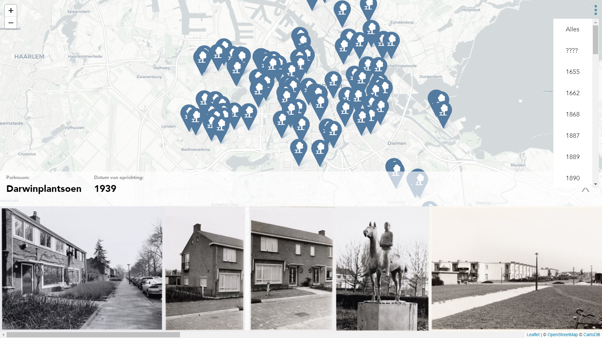

 # Parken & Plantsoenen

In this repo you can find the app I made from scratch. The app is based on a sparQL service from [`Adamlink`](https://data.adamlink.nl/AdamNet/all). It shows all parks of Amsterdam in a map.


> My work
> [**Velomovies**](https://velomovies.github.io/Project-1-WEBDEV/app).

## Background

The app shows all parks of Amsterdam. You can choose the park and it loads all photos. Next to that you can choose a date. Per park it shows when the park is build. 

On the homepage you see a map with all parks. When clicked on a park it starts a function on the hash change. When the data gets updated in the future it should automatically show more data. 

## Data

The app uses the sparQL service of [`Adamlink`](https://data.adamlink.nl/AdamNet/all). The service uses a few databases and connects them. This ensures that we can make a comprehensive app.

Because the data changes constantly we can make an app which may or may not be bigger in the future. 

The queries I used where:
```
PREFIX dct: <http://purl.org/dc/terms/>
      PREFIX foaf: <http://xmlns.com/foaf/0.1/>
      PREFIX dc: <http://purl.org/dc/elements/1.1/>
      PREFIX owl: <http://www.w3.org/2002/07/owl#>
      PREFIX wd: <http://www.wikidata.org/entity/>
      PREFIX wdt: <http://www.wikidata.org/prop/direct/>
      PREFIX rdfs: <http://www.w3.org/2000/01/rdf-schema#>
      PREFIX sem: <http://semanticweb.cs.vu.nl/2009/11/sem/>
      PREFIX geo: <http://www.opengis.net/ont/geosparql#>
      
      SELECT ?ALstreet ?ALstreetLabel ?date ?wkt WHERE {
        {
          SERVICE <https://query.wikidata.org/sparql> {
            ?park wdt:P31 wd:Q22698  .
            ?park wdt:P131 wd:Q9899 .
          }
          ?ALstreet owl:sameAs ?park .
          ?ALstreet rdfs:label ?ALstreetLabel .
          OPTIONAL {?ALstreet sem:hasEarliestBeginTimeStamp ?date . }
          ?ALstreet geo:hasGeometry ?geo .
          ?geo geo:asWKT ?wkt .
        }
          UNION {
          ?ALstreet rdfs:label ?ALstreetLabel .
          FILTER REGEX(?ALstreetLabel,"park$") .
          OPTIONAL {?ALstreet sem:hasEarliestBeginTimeStamp ?date . }
          ?ALstreet geo:hasGeometry ?geo .
          ?geo geo:asWKT ?wkt .
        }  
          UNION {
          ?ALstreet rdfs:label ?ALstreetLabel .
          FILTER REGEX(?ALstreetLabel,"plantsoen$") .
          OPTIONAL {?ALstreet sem:hasEarliestBeginTimeStamp ?date . }
          ?ALstreet geo:hasGeometry ?geo .
          ?geo geo:asWKT ?wkt .
        }  
      }
      GROUP BY ?ALstreet ?ALstreetLabel ?date ?wkt
      ORDER BY ?date
```

```
PREFIX dct: <http://purl.org/dc/terms/>
      PREFIX foaf: <http://xmlns.com/foaf/0.1/>
      PREFIX dc: <http://purl.org/dc/elements/1.1/>
      SELECT ?imgurl ?type ?title WHERE {
        ?bbitem dct:spatial <https://adamlink.nl/geo/${parkLink.uri}> .
        ?bbitem foaf:depiction ?imgurl .
        ?bbitem dc:type ?type .
        ?bbitem dc:title ?title .
      }
      LIMIT 100
```

The year you want to show you can choose yourself

## Features

I implemented a few features:
* Show every park on the map
* See all photo's of the selected park
* Show the year when the park was build
* Filter all years
* Custom markers
* Marker shows active

### Wishlist
Most of the features I wanted in this app I implemented succesfully. Below is a little list of some features I would like to have.
* Search function to search a artist and see their art pieces
* A way to select art pieces from a specific date
* Show a image per artist in the home section
* A slick design

## Sources

### Libraries

> Transparency [Leonidas](https://github.com/leonidas/transparency) (for templating)

> Routie [Jgallen](https://github.com/jgallen23/routie) (for routing on hash change)

> Leafletjs [Vladimir Agafonkin](http://leafletjs.com/) (for rendering a map)

> Terraformer [Esri](https://github.com/Esri/terraformer) (for making usable geojson)

## License

GPL-3.0 © Victor Zumpolle